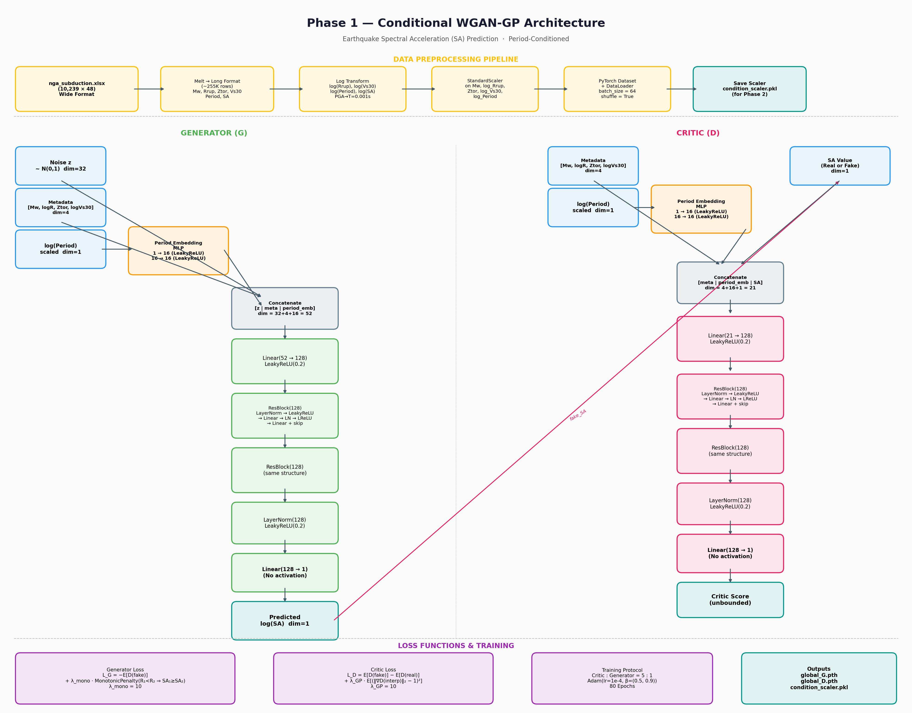
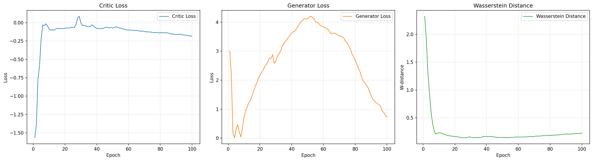
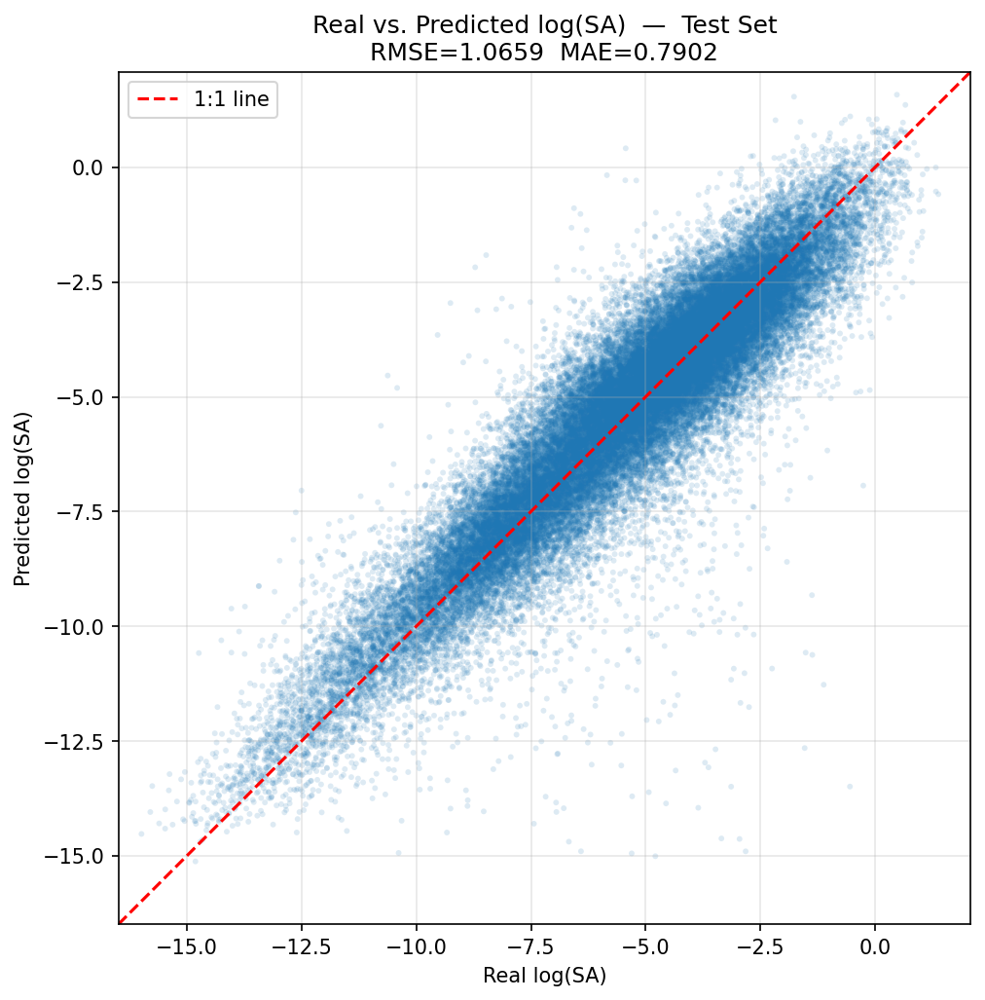
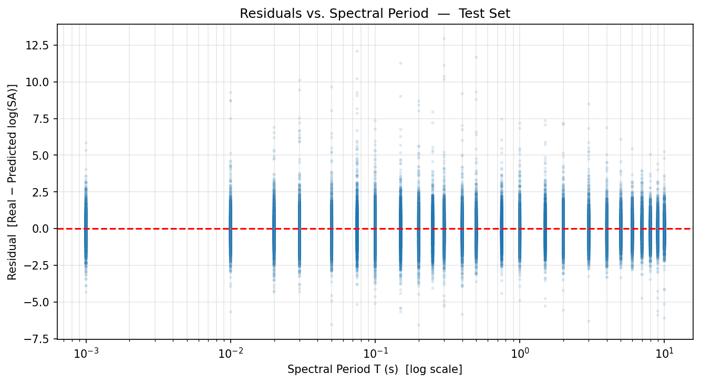
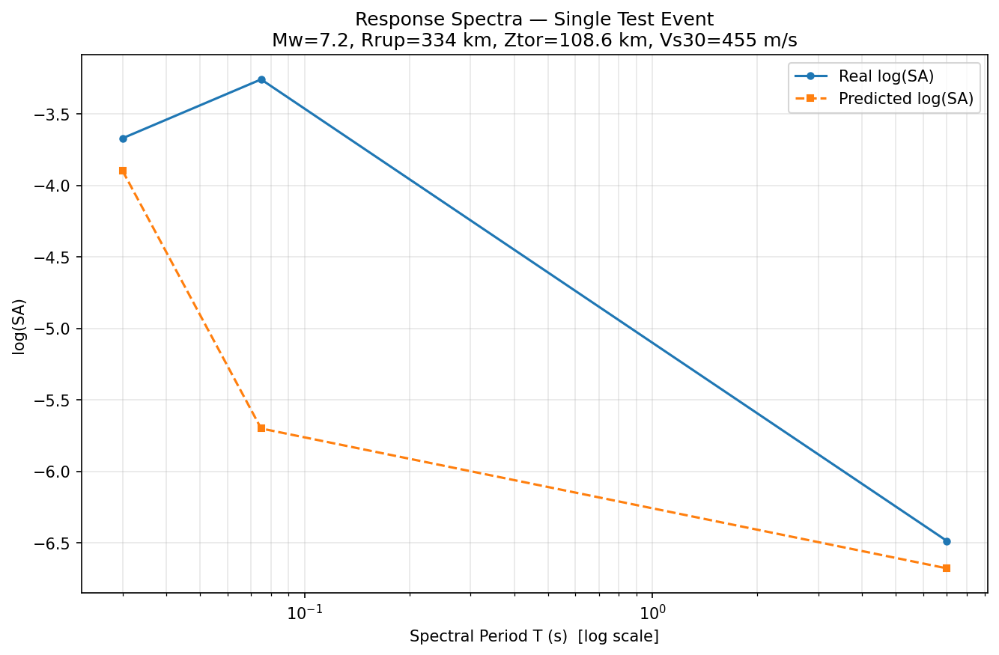

# Physics-Informed CWGAN-GP for Earthquake Ground Motion Prediction

A **Conditional Wasserstein GAN with Gradient Penalty (CWGAN-GP)** that learns to predict earthquake **Spectral Acceleration (SA)** from seismological parameters, augmented with a **physics-informed monotonic distance-attenuation penalty**.

This is **Phase 1** of a multi-phase research project developed in collaboration with **IIT Mandi**.

## Overview

Ground Motion Models (GMMs) are essential in seismic hazard analysis for predicting the intensity of earthquake shaking at a site. This project replaces traditional empirical GMMs with a generative model that captures the full conditional distribution of Spectral Acceleration.

**Generator input:** earthquake metadata `(Mw, Rrup, Ztor, Vs30)` + tectonic one-hot vector `(interplate, intraplate)` + spectral period `T` + latent noise `z`
**Generator output:** predicted `log10(SA)` (base-10 log of Spectral Acceleration)

### Key Design Choices

- **WGAN-GP training** with gradient penalty (lambda_GP = 10) and 5:1 critic-to-generator update ratio for stable training
- **Physics-informed monotonic penalty** (lambda_mono = 10) enforces the physical constraint that SA must decrease with increasing rupture distance (Rrup)
- **Tectonic-type conditioning** — `Inter_intra_flag` is converted into a 2D one-hot vector so the model can distinguish interplate and intraplate events
- **Period Embedding MLP** — a shared 2-layer network maps the 1D `log10(Period)` to a 16-dimensional representation used by both Generator and Critic
- **Residual blocks with LayerNorm** — both Generator and Critic use pre-activation residual blocks (2 x ResBlock(128))

## Architecture



| Component  | Parameters |
|------------|-----------|
| Generator  | 74,801    |
| Critic     | 70,833    |

## Dataset

**NGA-Subduction (NGA-Sub)** — a widely used strong-motion database in earthquake engineering.

- **Source:** `nga_subduction.xlsx` (10,239 records x 48 columns)
- **Conditioning variables:** Mw (magnitude), Rrup (rupture distance), Ztor (depth to top of rupture), Vs30 (site shear-wave velocity), plus a one-hot tectonic category from `Inter_intra_flag`
- **Target:** Spectral Acceleration at 25 periods from PGA (T=0) to T=10s
- **Working dataset:** 255,975 samples after melting to long format (one row per record-period pair)
- **Train/Test split:** 80/20 (204,780 / 51,195 samples)

## Results

Training is configured for 100 epochs with batch size 2048 and Adam optimizer `(lr=1e-4, betas=(0.5, 0.9))`.

| Loss Curves | Real vs Predicted |
|:-----------:|:-----------------:|
|  |  |

| Residuals vs Period | Response Spectra (Single Event) |
|:-------------------:|:-------------------------------:|
|  |  |

The updated notebook evaluates errors in `log10(SA)` space and plots response spectra back in the original `SA` scale.

Note: the committed `.pth` checkpoints and `.png` figures in this repo were generated before the latest teacher-review updates. Re-run the notebook to regenerate artifacts that reflect the new one-hot tectonic input and `log10(SA)` target.

## Project Structure

```
.
├── Phase1_CWGAN_GP.ipynb        # Main notebook (current)
├── Phase1_CWGAN_GP_old.ipynb    # Earlier version (no train/test split)
├── Phase1_Architecture.png      # Model architecture diagram
├── nga_subduction.xlsx           # NGA-Sub earthquake dataset
├── global_G.pth                  # Trained Generator weights
├── global_D.pth                  # Trained Critic weights
├── condition_scaler.pkl          # Fitted StandardScaler for conditioning features
├── loss_curves.png               # Training loss plots
├── real_vs_pred.png              # Test-set scatter plot
├── residuals_vs_period.png       # Residuals vs spectral period
├── response_spectra_event.png    # Per-event response spectra comparison
└── old/                          # Artifacts from a previous run
```

## Getting Started

### Prerequisites

```
torch
numpy
pandas
matplotlib
scikit-learn
joblib
openpyxl
```

### Running on Google Colab (recommended)

1. Upload the project folder to Google Drive under `MyDrive/WGAN_IITM/`
2. Open `Phase1_CWGAN_GP.ipynb` in Colab
3. The notebook auto-detects Colab and mounts Google Drive
4. Run all cells sequentially

### Running Locally

```bash
pip install torch numpy pandas matplotlib scikit-learn joblib openpyxl
jupyter notebook Phase1_CWGAN_GP.ipynb
```

A CUDA GPU is recommended but not required — the models are small (~75K and ~71K parameters).

## Saved Artifacts

After training completes, the following artifacts are saved for downstream use (Phase 2):

| File | Description |
|------|-------------|
| `global_G.pth` | Generator state dict |
| `global_D.pth` | Critic state dict |
| `condition_scaler.pkl` | Fitted StandardScaler for the 5 continuous conditioning features (`Mw`, `log(Rrup)`, `Ztor`, `log(Vs30)`, `log10(Period)`) |

## License

This project is part of ongoing research. Please contact the authors before using the code or data for publications.
